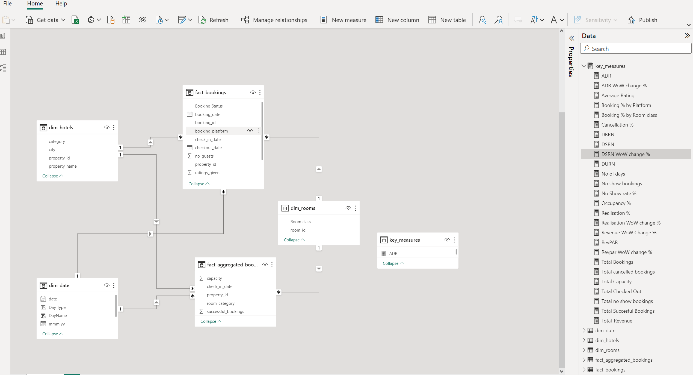

# Atliq-hospitality-power-bi-dashboard

Welcome to the AtliQ Grands Revenue Insights project ! In this project, I have implemented data analytics using Power BI to empower AtliQ Grands with the ability to make data-driven decisions, surpass competitors in the market, and drive growth in various aspects like Market Share & Revenue.

# Business problem:
AtliQ Grands is the proud owner of numerous opulent hotels throughout India. Yet, AtliQ Grands finds itself experiencing a decline in both market share and revenue within the luxurious/business hotel sector. 
I, as a data analyst, figure out the key problem of declining revenue using data analytics.

# Key Performance Metrics:
### Revenue:— Measure the total revenue generated by AtliQ Grands.

###  1. Realization Percentage:  — Calculate the percentage of actual revenue compared to the potential revenue.

###  2. Occupancy Percentage:   — Analyze the percentage of occupied rooms to the total available rooms.

###  3. Average Daily Revenue:    —Determine the average revenue earned per day.

###  4.  Daily Booked Rooms per Night:    Track the number of rooms booked daily.

###  5.  Average Rating:    — Evaluate the average hotel customer rating.

# Data modeling:
Data modeling plays a pivotal role and serves as the foundation for generating meaningful reports. The entire framework of visualizations is constructed upon a well-designed data model. Neglecting proper data modeling can have adverse effects on the overall performance of the generated reports.

In the context of this project, we have meticulously followed the Snowflake data modeling method. This approach involves structuring data into normalized forms, resulting in reduced redundancy and improved query performance. This methodology enhances the way we organize and process data, ensuring optimal results for our analysis.





Creating calculated measures:
ADR Calculate the ADR (Average Daily rate). It is the ratio of revenue to the total rooms booked/sold. It is the measure of the average paid for rooms sold in a given time period.

```
ADR = DIVIDE( [Revenue], [Total Bookings],0)
```
                                                                                                                                                                                                                                                                                                                                                                                                                                                                                                       
Realization % calculates the realization percentage. It is nothing but the successful “checked out” percentage of overall bookings happened.

```
Realisation % = 1- ([Cancellation %]+[No Show rate %])
```
 <br>
 
RevPAR Calculate the RevPAR (Revenue Per Available Room) RevPAR represents the revenue generated per available room, whether or not they are occupied. RevPAR helps hotels measure their revenue-generating performance to accurately price rooms. RevPAR can help hotels measure themselves against other properties or brands.
```
RevPAR = DIVIDE([Revenue],[Total Capacity])
```
DBRN calculates DBRN (Daily Booked Room Nights). This metric tells on average how many rooms are booked for a day considering a time period.

```
DBRN = DIVIDE([Total Bookings], [No of days])
```
DSRN calculates DSRN (Daily Sellable Room Nights). This metric tells on average how many rooms are ready to sell for a day considering a time period.

```
DSRN = DIVIDE([Total Capacity], [No of days])
```
DURN calculate DURN (Daily Utilized Room Nights). This metric tells on average how many rooms are successfully utilized by customers for a day considering a time period.

```
DURN = DIVIDE([Total Checked Out],[No of days])
```
Revenue WoW change % indicates revenue change percentage week over week.

```
Revenue WoW change % = 
        Var selv = IF(HASONEFILTER(dim_date[wn]),SELECTEDVALUE(dim_date[wn]),MAX(dim_date[wn]))
        var revcw = CALCULATE([Revenue],dim_date[wn]= selv)
        var revpw = CALCULATE([Revenue],FILTER(ALL(dim_date),dim_date[wn]= selv-1))
        
        return
        DIVIDE(revcw,revpw,0)-1
```

Occupancy WoW change % indicates occupancy change percentage week over week.

```
Occupancy WoW change % = 
        Var selv = IF(HASONEFILTER(dim_date[wn]),SELECTEDVALUE(dim_date[wn]),MAX(dim_date[wn]))
        var revcw = CALCULATE([Occupancy %],dim_date[wn]= selv)
        var revpw = CALCULATE([Occupancy %],FILTER(ALL(dim_date),dim_date[wn]= selv-1))
        
        return
        DIVIDE(revcw,revpw,0)-1
```

ADR WoW change % helps to find the ADR (Average Daily rate) change percentage week over week.

```
ADR WoW change % = 
        Var selv = IF(HASONEFILTER(dim_date[wn]),SELECTEDVALUE(dim_date[wn]),MAX(dim_date[wn]))
        var revcw = CALCULATE([ADR],dim_date[wn]= selv)
        var revpw = CALCULATE([ADR],FILTER(ALL(dim_date),dim_date[wn]= selv-1))
        
        return
        DIVIDE(revcw,revpw,0)-1
```

Cancellation % calculating the cancellation percentage.

```
Cancellation % = DIVIDE([Total cancelled bookings],[Total Bookings])
```
<br>
<br>
<br>

# Power-bi-dashboard


